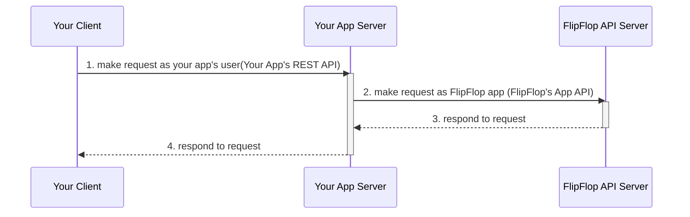

# FlipFlop Sample App Server

```text
💡 Note: This document is for FlipFlop Lite which is the second generation or enhanced version of FlipFlop. However, for convenience FlipFlop Lite will be referred to as FlipFlop in the remaining of the document or in the documentation provided in the source code.
```

## Introduction

This NestJS app provides one example of how to integrate FlipFlop with an app.
This example is focused on helping you learn about FlipFlop's API and functionality.
Since apps can have different features, requirements, and policies, FlipFlop has been designed to be as convenient and flexible as possible.
If you understand how FlipFlop works through this example, I believe you will be able to modify the approach shown in this example to suit your preferences and use it in the desired form.

Please look for `IMPORTNT_TIPS` in the source code for helpful information.

## Scope of the Application

Basically, the sample app does the following.

* An app that corresponds to this sample app, so called a FlipFlop app is created in FlipFlop's user console.
* The sample app consists of a simple mongodb database
  * Only the users are managed from the database
  * Users will be able to sign up, login, and update their information through the app's REST API
  * User authorization is done with JWT access token with a long expire time and there is now refresh token
  * User information will be synchronized in the FlipFlop app when users sign up, login, and update their information using FlipFlop App API
* Users will be able to create, list, and view entities for live streaming
  * The entities will be created with FlipFlop App API and will be managed by FlipFlop
* Users will be able to create, list, and view entities for static video
  * The entities will be created with FlipFlop App API and will be managed by FlipFlop

And how it works can be simplified into the following diagram.



The integration is for transforming 1 to 2 in your app server.

## Quick Start

Follow these steps if you would like to test this sample right away.

1. Goto FlipFlop user console and sign up to become a FlipFlop user
    * If you reside in northeast asia <https://console.lite.flipflop.tv>
    * Service for southeast Asia will be available soon

      ```text
      💡 Note: FlipFlop is not yet a global service. Please select the region nearest to you for better experience.
      ```

      ```text
      💡 Note: Signup for an account can be done by request at the moment.
      ```

2. Sign in to FlipFlop and create an app. The app will be the FlipFlop app that will be integrated into your app.
    * You will be provided with an App API key and secret for credentials later
    * You will never have access to your App API secret after this opportunity so please save it somewhere safe

      ```text
      💡 Note: If you forget your credentials it could be reissued.
      ```

3. Prepare the environment to run the sample app server
    * A MongoDB instance to connect to with read/write permissions
    * Nodejs runtime and NPM

4. Run the sample app
    * Clone the repository or download the source code and extract it to your desired location
    * Create a .env file in the project root and copy the content of the following and fill in the values suitable to you

      ```shell
      # The port your sample app server will be listening to incoming requests.
      # Defaults to 3000 value not specified
      PORT=
      # URI of the MongoDB
      MONGO_DB_URI=
      # JWT secret to use for signing JWT
      JWT_SECRET=secret
      # FlipFlop Lite App API Endpoint
      # The endpoint specified here is for northeast asia region
      FFL_API_BASE_URL=https://api.lite.flipflop.tv/v2/apps/me
      # FlipFlop Lite App API key from step 2
      FFL_APP_API_KEY=
      # FlipFlop Lite App API secret from step 2
      FFL_APP_API_SECRET=
      ```

    * Install dependencies

      ```shell
      $ npm install
      ```

    * Run the app

      ```shell
      $ npm run start
      ```

5. Install the FlipFlop SDK sample app of your choice
    * [FlipFlop Lite SDK Android Sample App](https://github.com/jocoos-public/ff-lite-sample-sdk-android)
    * Link to iOS FlipFlop Lite SDK sample app repository will be added soon

## Highlights for Understanding the Sample App Server

### User Information Synchronization

The task of synchronizing user information managed in your app with FlipFlop is not mandatory, but it can help alleviate many tasks if you choose to synchronize. After reading the documentation for this sample app server and examining the source code, please understand the effects and benefits of user information synchronization and decide whether synchronization is necessary.

However, for the sake of brevity in the document, let's proceed with the assumption that synchronization is performed.

#### Registering Your App User as Your FlipFlop App Member

To synchronize, it is essential to register the user's ID with FlipFlop. Here, the user ID refers to a unique value that identifies the respective user stored in the database. Additionally, two string attributes can be synchronized.

The user's unique ID should be registered as the `appUserId` attribute, and the other two strings can be synchronized of the attribute names `appUserName` and `appUserProfileImgUrl`. As the name `appUserName` suggests it is meant for human readable identifiers such as username, nickname, and user handle. Likewise  `appUserProfileImgUrl` is intended for profile picture URL. Nonetheless, you may choose to use it for other purposes.

* To learn about the API for registering a user to FlipFlop, please refer to the `createMember()` method in the "ff-api.service.ts" file
* Member entity is created in your FlipFlop app when a user is registered to FlipFlop
* Notice that `createMember()` method is invoked when a user is created when the client app makes a request to [Sign Up API to this app server](#sign-up)
  * Follow `UsersController#create()` -> `UsersService#create()`

#### Another Way to Register a User to Your FlipFlop App (Also Logging in)

If your app is already deployed and users already exist, they can be registered to FlipFlop using the API for logging in to FlipFlop. This FlipFlop App API should be used when an existing user is logging into your app. The API for logging in to FlipFlop has the same effect as the registration API, but the difference is that it returns credential information that can be used in FlipFlop. The credential information for use in FlipFlop consists of access/refresh/streaming tokens. These tokens are necessary credentials if your app users need to directly access the FlipFlop server. Currently, there are no specific functionalities that require these tokens, but soon there will be additional features that will provide various functionalities, allowing users to use FlipFlop's features on a limited basis without going through your app's server.

Besides the affect of registering and logging in, calling the login FlipFlop App API is another opportunity to synchornize user data with FlipFlop. If you are to fully synchronize user data between your app and FlipFlop it is recommended to provide all three (appUserId, appUserName, appUserProfileImgUrl) information in the API invocation.

* To learn about the API for logging in a user to FlipFlop, please refer to the `loginAsMember()` method in the "ff-api.service.ts" file
* The user will be registered upon successful login to FlipFlop if not registered.
* Notice that `loginAsMember()` method is invoked when a user logs in to your app by making a request to [Login API to this app server](#login)
  * Follow from source code: `AuthController#login()` -> `AuthService#login()`

#### Synchronizing User Updates and Deletion

To fully synchronize user information, if a user in your app updates their own information or decides to leave the app, that information must also be synchronized. Therefore, if a user changes their username or user profile image used in the app, or if they withdraw from the app, you must update or delete the corresponding Member entity in FlipFlop using the FlipFlop App API to ensure the synchronization reflects the latest information.

* To learn about the API for updating user information in FlipFlop, please refer to the `updateMember()` method in the "ff-api.service.ts" file
* Notice that `updateMember()` method is invoked when a user updates their information in your app by making a request to [Update User API to this app server](#update-user)
  * Follow from source code: `UsersController#update()` -> `UsersService#update()`
* To learn about the API for deleting user information in FlipFlop, please refer to the `deleteMember()` method in the "ff-api.service.ts" file
* Notice that `deleteMember()` method is invoked when a user leaves the app by making a request to [Delete User API to this app server](#delete-user)
  * Follow from source code: `UsersController#remove()` -> `UsersService#remove()`

### Using VideoRoom

VideoRoom is a feature that allows multiple people to communicate through video. Currently, VideoRoom supports stable broadcasting in the form of `BROADCAST_RTMP` when the creator broadcasts a live stream using RTMP, which is then converted to CMAF, enabling many people to watch. In the future, various and enhanced functionalities will be provided using multiple protocols. Planned features are `BROADCAST_WEBRTC`, `WEBINAR`, `VIDEO_CONFERENCE`, `SURVEILLANCE`. However, for the purpose of this document, the focus will be on describing how to use `BROADCAST_RTMP` type VideoRoom.

#### Creation of VideoRooms

VideoRoom can currently be created in two main ways. The first method is by accessing the FlipFlop user console and entering your FlipFlop app management screen to create it. The second method is by using the App API to create it. When creating a VideoRoom, it must be associated with FlipFlop members. Therefore, if users are not registered in the FlipFlop app, VideoRoom creation is not possible. If, as an app operator from an app management perspective, you want to create a VideoRoom through the user console, please remember that you need to register at least one FlipFlop member who can be the creator of the VideoRoom. To enable users to do live broadcasting through the app, you need to allow users to create VideoRooms through the app server. In this scenario, if the user registration and information synchronization have been diligently carried out, there should be no issues as the users are already registered.

* To learn about the API for creating VideoRoom in FlipFlop, please refer to the `createVideoRoom()` method in the "ffl-api.service.ts" file
* Notice that `createVideoRoom()` method is invoked upon user making a request for creating the VideoRoom using the [Create VideoRoom API to this app server](#create-videoroom)
  * Follow from source code: `VideoRoomsController#create()` -> `VideoRoomsService#create()`

#### Enabling VideoChatRoom in VideoRoom

VideoRoom feature is equipt with the chatting feature. Viewers in the VideoRoom are able to chat with fellow audiences using the feature. However, the VideoChatRoom does not come along with VideoRoom by default. It explicitly has to be created.

* To learn about the API for creating VideoChatRoom in FlipFlop, please refer to the `createVideoChatRoom()` method in the "ffl-api.service.ts" file
* If you want to enable the chatting feature in VideoRoom by default for your users, you can create the VideoChatRoom when the VideoRoom is created from the server

Also, in order to provide VideoChatRoom feature you will have to implement an API so that users could request credentials for entering the VideoChatRoom.

* Follow from source code: `AuthController#issueChatToken()` -> `AuthService#issueChatToken()`

Detailed information on VideoChatRoom will be added later

#### StreamKey and Broadcasting to VideoRoom

If a `BROADCAST_RTMP` type VideoRoom is created, the creator could start broadcasting live stream via the VideoRoom. In order to do so the creator must use its StreamKey to ingest live RTMP stream to FlipFlop. Therefore, the app must provide a way for the user to find out their StreamKey.

* To learn about the API for getting information of a user's StreamKey, please refer to the `getMemberStreamKey()` method in the "ffl-api.service.ts" file
* Alternativeley, `getStreamKeys()` method in the "ffl-api.service.ts" file can also be used but
  * You would have to use query parameters to search the StreamKey of a specific user
  * And also have to check if the user requesting for the StreamKey is requesting for their own StreamKey
* Notice that there is an API which calls `getMemberStreamKey()` to respond the user with information about their StreamKey.
  * Follow from source code: `UsersController#getMemberStreamKey()` -> `UsersService#getMemberStreamKey()`

When users obtain information about their StreamKey, they can use that information to ingest RTMP streams into FlipFlop. If the ingest is successful, the video is converted to the CMAF format and will be ready for public view. To make the video available to the public, users need to start a broadcast in one of the VideoRooms they have created. Only then will the video, converted to CMAF, will be made public through the VideoRoom that initiated the broadcast. The the user is finished broadcasting, the boradcast must be explicitly ended. When the broadcast is ended the recording is transcoded and becomes ready for VOD as a VideoPost.

* To learn about the API for starting/ending a broadcast from a VideoRoom, please refer to the `startRtmpToCmafBroadcast()` and `endRtmpToCmafBroadcast()` method in the "ffl-api.service.ts" file
* Notice that a check on whether the reqest is coming from the owner of the VideoRoom is done in [Start VideoRoom Broadcast API](#start-videoroom-broadcast) and [End VideoRoom Broadcast API](#end-videoroom-broadcast) as these operations should be only requested by the creator of the VideoRoom.
  * Follow from source code: `VideoRoomsController#startRtmpToCmafBroadcast()` -> `VideoRoomsService#startRtmpToCmafBroadcast()`
  * Follow from source code: `VideoRoomsController#stopRtmpToCmafBroadcast()` -> `VideoRoomsService#stopRtmpToCmafBroadcast()`

```text
💡 Note: RTMP stream ingest could be done with any software capable of streaming video with RTMP. If you would like to ingest video from your mobile app any library capable of streaming video with RTMP can be used. FlipFlop Lite Android/iOS SDK is also an option.
```

#### Listing and Viewing VideoRoom and Playing the Broadcast

You can manage information of VideoRooms for yourself by building a database with VideoRoom information obtained upon creation from the response. Fortunately, it is not required as FlipFlop does it for you unless the basic feature for listing and getting VideoRoom information does not meet your needs. This is where synchronization of user information comes handy. In the query result of VideoRooms is information of the creators. If all information was synchronized as intended there is no need for extra queries to render the creator's information from the client.

* To learn about the API for listing VideoRooms, please refer to the `getVideoRooms()` method in the "ffl-api.service.ts" file.
* To learn about the API for getting information of a specific VideoRoom, please refer to `getVideoRooms()` method in the "ffl-api.service.ts" file

If there is a live broadcast for a VideoRoom there is a URL of the live broadcast in the VideoRoom information.

```text
💡 Note: The URL of the live broadcast of VideoRoom Info can be played and viewed from most media players (requires support for HLS or MPEG-DASH). FlipFlop Lite Android/iOS SDK also comes with a media player.
```

## API

Here is documentation of the sample app's REST API.

### Common

#### Enumerated Types

<details>
<summary>AccessLevel (from FlipFlop API)</summary>

##### Values for AccessLevel

* `PUBLIC`
* `APP`
* `MEMBER`
* `FOLLOWER`
* `FRIEND`
* `RESTRICTED`
* `PRIVATE`

</details>

<details>
<summary>EntityState (from FlipFlop API)</summary>

##### Values for EntityState

* `ACTIVE`
* `DELETED`

</details>

<details>
<summary>CreatorType (from FlipFlop API)</summary>

##### Values for CreatorType

* `USER`
* `APP`
* `MEMBER`

</details>

<details>
<summary>StreamKeyState (from FlipFlop API)</summary>

##### Values for StreamKeyState

* `INACTIVE`
* `ACTIVE_PREP`
* `ACTIVE`
* `ACTIVE_LIVE`
* `INACTIVE_LIVE`
* `ACTIVE_LIVE_PREP`

</details>

<details>
<summary>VideoFormat (from FlipFlop API)</summary>

##### Values for VideoFormat

* `UNDEFINED`
* `CMAF`

</details>

<details>
<summary>VideoPostState (from FlipFlop API)</summary>

##### Values for VideoPostState

* `CREATED`
* `UPLOADED`
* `QUEUED`
* `PROCESSING`
* `PROCESSED`
* `FAILED_UPLOAD`
* `FAILED_QUEUING`
* `FAILED_PROCESSING`

</details>

<details>
<summary>VideoRoomState (from FlipFlop API)</summary>

##### Values for VideoRoomState

* `SCHEDULED`
* `CANCELLED`
* `LIVE`
* `LIVE_INACTIVE`
* `ENDED`
* `ACTIVE`
* `INACTIVE`

</details>

<details>
<summary>VideoRoomType (from FlipFlop API)</summary>

##### Values for VideoRoomType

* `BROADCAST_RTMP`
* `BROADCAST_WEBRTC`
* `WEBINAR`
* `VIDEO_CONFERENCE`
* `SURVEILLANCE`

</details>

<details>
<summary>VideoRoomVodState (from FlipFlop API)</summary>

##### Values for VideoRoomVodState

* `NOT_ARCHIVED`
* `ARCHIVING`
* `ARCHIVED`
* `FAILED_ARCHIVING`

</details>

<details>
<summary>VideoTranscodingProfileType (from FlipFlop API)</summary>

##### Values for VideoTranscodingProfileType

* `VIDEO`
* `THUMBNAIL`
* `PREVIEW`
* `BROADCAST_RTMP`

</details>

### Auth

<details>
  <summary>Login - POST /auth/login</summary>

#### **Login**

Login a user to your app and your FlipFlop app. The user will be registered to your FlipFlop app during the login process if not registered before.

##### Request Parameters for **Login**

* Headers

  | Header | Value |
  | - | - |
  | `Content-Type` | `application/json` |

* Body

  | Parameter | Type | Description |
  | - | - | - |
  | `username` | String | username of the user |
  | `password` | String | account password |

##### Response for **Login**

* Status Code: 200 OK

  | Property | Type |
  | - | - |
  | `accessToken` | String |
  | fflTokens | Object |
  | fflTokens.`accessToken` | String |
  | fflTokens.`refreshToken` | String |
  | fflTokens.`streamingToken` | String |

* Errors
  * TODO

</details>

<details>
  <summary>Issue Chat Token - POST /auth/chat-token</summary>

#### **Issue Chat Token**

Issue token for accessing chat server.

##### Request Parameters for **Issue Chat Token**

* Headers

  | Header | Value |
  | - | - |
  | `Authorization` | Bearer ${accessToken} |

##### Response for **Issue Chat Token**

* Status Code: 200 OK

  | Property | Type | Description |
  | - | - | - |
  | chatServerWebSocketUrl | String | Enpoint for connecting to websocket chat server |
  | chatToken | String | This value will be provided to FlipFlop Lite SDK for chatting |
  | userId? | String | This value will be provided to FlipFlop Lite SDK for chatting |
  | userName? | String |  This value will be provided to FlipFlop Lite SDK for chatting |
  | avatarProfileUrl? | String | This value will be provided to FlipFlop Lite SDK for chatting |

* Errors

  | Status Code | Message |
  | - | - |
  | | |

</details>

### Users

<details>
  <summary>Sign Up - POST /users</summary>

#### **Sign Up**

Create a user for your app and register to your FlipFlop app.

##### Request Parameters for **Sign Up**

* Headers
 
  | Header | Value |
  | - | - |
  | `Content-Type` | `application/json` |

* Body

  | Parameter | Type | Description |
  | - | - | - |
  | `username` | String | Human readable id, unique and not modifiable |
  | `password` | String | Account password |
  | `email` | String | User contact email |

##### Response for **Sign Up**

* Status Code: 201 CREATED

  | Property | Type | Description |
  | - | - | - |
  | `username` | String | Human readable id, unique and not modifiable |
  | `password` | String | Account password |
  | `email` | String | User contact email |
  | `createdAt` | Date | Date created |
  | `updatedAt` | Date | Date last modified |

* Errors

  | Status Code | Message |
  | - | - |
  | | |

</details>

<details>
  <summary>Get Users - GET /users</summary>

#### **Get Users**

Get list of users.

##### Request Parameters for **Get Users**

* Headers

  | Header | Value |
  | - | - |
  | `Authorization` | Bearer ${accessToken} |

##### Response for **Get Users**

* Status Code: 200 OK

  | Property | Type | Description |
  | - | - | - |
  |  |  |  |

* Errors

  | Status Code | Message |
  | - | - |
  | | |

</details>

<details>
  <summary>Get User - GET /users/:userId</summary>

#### **Get User**

Get information of a single user.

##### Request Parameters for **Get User**

* Path

  | Variable | Description |
  | - | - |
  | `userId` | Id of the user in app |

* Headers

  | Header | Value |
  | - | - |
  | `Authorization` | `Bearer ${accessToken}` |

##### Response for **Get User**

* Status Code: 200 OK

  | Property | Type | Description |
  | - | - | - |
  | `username` | String | Human readable id, unique and not modifiable |
  | `password` | String | Account password |
  | `email` | String | User contact email |
  | `createdAt` | Date | Date created |
  | `updatedAt` | Date | Date last modified |

* Errors

  | Status Code | Message |
  | - | - |
  | | |

</details>

<details>
  <summary>Update User - PATCH /users/:userId</summary>

#### **Update User**

Update user information in app and also your FlipFlop app.
##### Request Parameters for **Update User**

* Path

  | Variable | Description |
  | - | - |
  | `userId` | Id of the user in app |

* Headers

  | Header | Value |
  | - | - |
  | Authorization | Bearer ${accessToken} |
  | `Content-Type` | `application/json` |

* Body
  
  | Parameter | Type | Description |
  | - | - | - |
  | `password`? | String | |
  | `email`? | String | |

##### Response for **Update User**

* Status Code: 200 OK
  * Refer to [Response for **Get User**](#response-for-get-user)

</details>

<details>
  <summary>Delete User - DELETE /users/:userId</summary>

#### **Delete User**

Delete a user from app and your FlipFlop app
##### Request Parameters for **Delete User**

* Headers

  | Header | Value |
  | - | - |
  | `Authorization` | `Bearer ${accessToken}` |

##### Response for **Delete User**

* Status Code: 204 NO_CONTENT
* Errors

  | Status Code | Message |
  | - | - |
  | | |

</details>

<details>
  <summary>Get User StreamKey - GET /users/:userId/stream-key</summary>

#### **Get User StreamKey**

Get a users's FlipFlop StreamKey for broadcasting RTMP stream.

##### Request Parameters for **Get User StreamKey**

* Path

  | Variable | Description |
  | - | - |
  | `userId` | ID of the user whose stream key you want to find out |

* Headers

  | Header | Value |
  | - | - |
  | `Authorization` | `Bearer ${accessToken}` |

##### Response for **Get User StreamKey**

* Status Code: 200 OK
  * Refer to [Response for Get StreamKey](#response-for-get-streamkey)

* Errors

  | Status Code | Message |
  | - | - |
  | | |

</details>

### StreamKeys

<details>
  <summary>Get StreamKey - GET /stream-keys/:streamKeyId</summary>

#### Request Parameters for **Get StreamKey**

* Path

  | Variable | Description |
  | - | - |
  | `streamKeyId` | Id of the StreamKey to get information |

* Headers

  | Header | Value |
  | - | - |
  | `Authorization` | `Bearer ${accessToken}` |

#### Response for **Get StreamKey**

* Status Code: 200 OK

  | Property | Type | Description |
  | - | - | - |
  | `id` | Long | StreamKey ID |
  | `state` | [Enum:EntityState](#values-for-entitystate) | ACTIVE, DELETED |
  | `streamKeyState` | [Enum:StreamKeyState](#values-for-streamkeystate) | INACTIVE, ACTIVE_PREP, ACTIVE, ACTIVE_LIVE_PREP, ACTIVE_LIVE, INACTIVE_LIVE |
  | `app` | Object | 앱 정보 |
  | app.`id` | Long | 앱 ID |
  | app.`state` | [Enum:EntityState](#values-for-entitystate) | ACTIVE, DELETED |
  | app.`name` | String | 앱 이름 |
  | `member` | Object | 멤버 정보 |
  | member.`id` | Long | 멤버 ID |
  | member.`state` | [Enum:EntityState](#values-for-entitystate) | ACTIVE, DELETED |
  | member.`appUserId` | String | 멤버 App User ID |
  | member.`appUserName`? | String | 멤버 App User Name |
  | member.`appUserProfileImgUrl`? | String | 멤버 App User 프로필 이미지 URL |
  | `videoRoom`? | Object | 비디오룸 정보, 방장의 방송 시작시 생성, 방송 종료 후 삭제 |
  | videoRoom.`id` | Long | 비디오룸 ID |
  | videoRoom.`state` | [Enum:EntityState](#values-for-entitystate) | ACTIVE, DELETED |
  | videoRoom.`type` | [Enum:VideoRoomType](#values-for-videoroomtype) | BROADCAST_RTMP, BROADCAST_WEBRTC, WEBINAR, VIDEO_CONFERENCE, SURVEILLANCE |
  | videoRoom.`title` | String | 비디오룸 제목 |
  | `ingestUrl`? | String | 방송 송출 RTMP Ingest URL |
  | `streamKey` | String | 방송 송출시 사용하는 StreamKey 문자열 |
  | `liveUrl`? | String | RTMP Ingest 시점에 생성되는 Live URL |
  | `profile` | Object | 방송 송출 사양 정보 |
  | profile.`id` | Long | 프로파일 ID |
  | profile.`state` | [Enum:EntityState](#values-for-entitystate) | ACTIVE, DELETED |
  | profile.`type` | [Enum:VideoTranscodingProfileType](#values-for-videotranscodingprofiletype) | |
  | profile.`name` | String | 프로파일 이름 |
  | profile.`profile` | Object | 프로파일 데이터 |
  | `error`? | Object | 미디어 서비스 에러 정보 |
  | error.`code`? | String | 에러 코드 |
  | error.`message` | String | 에러 메시지 |
  | error.`occurredAt`? | [iso8601] | 에러 발생 일시 |
  | `createdAt` | [iso8601] | 생성 일시 |
  | `lastModifiedAt` | [iso8601] | 마지막 수정 일시 |

* Errors

  | Status Code | Message |
  | - | - |
  |  |  |

</details>

<details>
  <summary>Get StreamKeys - GET /stream-keys</summary>

#### Request Parameters for **Get StreamKeys**

* Headers

  | Header | Value |
  | - | - |
  | `Authorization` | `Bearer ${accessToken}` |

* Query

  | Property | Type | Description |
  | - | - | - |
  |  |  |  |

#### Response for **Get StreamKeys**

* Status Code: 200 OK
  * Paginated response of [StreamKeys](#response-for-get-streamkey)

* Errors

  | Status Code | Message |
  | - | - |
  | | |

</details>

<details>
  <summary>Update StreamKey - PATCH /stream-keys/:streamKeyId</summary>

#### Request Parameters for **Update StreamKey**

* Path

  | Variable | Description |
  | - | - |
  | `streamKeyId` | Id of the StreamKey to update |

* Headers

  | Header | Value |
  | - | - |
  | `Authorization` | `Bearer ${accessToken}` |

* Body

  | Parameter | Type | Description |
  | - | - | - |
  | `profileId` | Long | Id of the transcoding profile to use for live streaming |

#### Response for **Update StreamKey**

* Status Code: 200 OK
  * Refer to [Response for Get StreamKey](#response-for-get-streamkey)

* Errors

  | Status Code | Message |
  | - | - |
  | | |

</details>

<details>
  <summary>Reissue StreamKey - POST /stream-keys/:streamKeyId</summary>

#### Request Parameters for **Reissue StreamKey**

* Path

  | Variable | Description |
  | - | - |
  | `streamKeyId` | Id of the StreamKey to reissue |

* Headers
  | Header | Value |
  | - | - |
  | `Athorization` | `Bearer ${accessToken}` |

#### Response for **Reissue StreamKey**

* Status Code: 200 OK
  * Refer to [Response for Get StreamKey](#response-for-get-streamkey)

* Errors
  | Status Code | Message |
  | - | - |
  | | |

</details>

### VideoRooms

<details>
  <summary>Create VideoRoom - POST /video-rooms</summary>

#### **Create VideoRoom**

Create VideoRoom for the user requesting it. A VideoRoom can be created with a title, description, and scheduled time. Scheduled time has no real meaning yet.

##### Request Parameters for **Create VideoRoom**

* Headers

  | Header | Value |
  | - | - |
  | `Authorization` | `Bearer ${accessToken}` |

* Body
  | Parameter | Type | Description |
  | - | - | - |
  | `appUserId` | String | user id of your app's user who it createing the video room |
  | `type` | [enum:VideoRoomType](#values-for-videoroomtype) | `BROADCAST_RTMP` |
  | `title`? | String | |
  | `description`? | String | |
  | `accessLevel`? | [enum:AccessLevel](#values-for-accesslevel) | Defaults to `PUBLIC` and other access levels are not working yet |
  | `scheduledAt` | Date | |

##### Response for **Create VideoRoom**

* Status Code: 201 CREATED

  | Property | Type | Description |
  | - | - | - |
  |  |  |  |

* Errors

  | Status Code | Message |
  | - | - |
  | | |

</details>

<details>
  <summary>Get VideoRooms - GET /video-rooms</summary>

#### **Get VideoRooms**

Get list of VideoRooms.

##### Request Parameters for **Get VideoRooms**

* Headers

  | Header | Value |
  | - | - |
  | `Authorization` | `Bearer ${accessToken}` |

##### Response for **Get VideoRooms**

* Status Code: 200 OK
  * Paginated response of [VideoRooms](#response-for-get-videoroom)

* Errors

  | Status Code | Message |
  | - | - |
  | | |

</details>

<details>
  <summary>Get VideoRoom - GET /video-rooms/:videoRoomId</summary>

#### **Get VideoRoom**

Get information of a single VideoRoom.

##### Request Parameters for **Get VideoRoom**

* Path

  | Variable | Description |
  | - | - |
  | `videoRoomId` | Id of the VideoRoom to get information |

* Headers

  | Header | Value |
  | - | - |
  | `Authorization` | `Bearer ${accessToken}` |

##### Response for **Get VideoRoom**

* Status Code: 200 OK

  | Property | Type | Description |
  | - | - | - |
  | `id` | Long | VideoRoom ID |
  | `state` | [Enum:EntityState](#values-for-entitystate) |  |
  | `videoRoomState` | [Enum:VideoRoomState](#values-for-videoroomstate) |  |
  | `vodState` | [Enum:VideoRoomVodState](#values-for-videoroomvodstate) |  |
  | `vodUrl`? | String | URL of the recorded broadcast for VOD. Value is assigned when `vodState` becomes `ARCHIVED`. Only applies to when `BROADCAST_RTMP` VideoRoom Type. |
  | `type` | [Enum:VideoRoomType](#values-for-videoroomtype) |  |
  | `format` | [Enum:VideoFormat](#values-for-videoformat) |  |
  | `accessLevel` | [Enum:AccessLevel](#values-for-accesslevel) |  |
  | `app` | Object | 앱 정보 |
  | app.`id` | Long | 앱 ID |
  | app.`state` | [Enum:EntityState](#values-for-entitystate) |  |
  | app.`name` | String | 앱 이름 |
  | `member` | Object | 멤버 정보 |
  | member.`id` | Long | 멤버 ID |
  | member.`state` | [Enum:EntityState](#values-for-entitystate) |  |
  | member.`appUserId` | String | 멤버 App User ID |
  | member.`appUserName`? | String | 멤버 App User Name |
  | member.`appUserProfileImgUrl`? | String | 멤버 App User 프로필 이미지 URL |
  | `creatorType` | [Enum:CreatorType](#values-for-creatortype) | 생성자 타입 USER, APP, MEMBER |
  | `creatorId` | Long | 생성자 ID |
  | `title` | String | Title of the VideoRoom |
  | `description`? | String | VideoRoom description |
  | `scheduledAt`? | [iso8601] | 스트리밍 방송 시작 예상 일시 |
  | `cancelledAt`? | [iso8601] | 스트리밍 방송 취소 일시 |
  | `liveStartedAt`? | [iso8601] | 스트리밍 방송 송출 시작 일시 |
  | `liveEndedAt`? | [iso8601] | 스트리밍 방송 송출 종료 일시 |
  | `vodArchivedAt`? | [iso8601] | 스트리밍 방송 녹화 완료 일시 |
  | `streamKey`? | Object | 스트리밍 방송 중일 경우 StreamKey 정보 |
  | streamKey?.`id` | Long | StreamKey ID |
  | streamKey?.`state` | [Enum:EntityState](#values-for-entitystate) |  |
  | streamKey?.`streamKeyState` | [Enum:StreamKeyState](#values-for-streamkeystate) | StreamKey 상태 |
  | `liveUrl`? | String | 스트리밍 방송 중일 경우 시청 가능한 URL |
  | `videoPost`? | Object | 녹화 진행 중인, 또는 완료된 VideoPost 정보 |
  | videoPost.`id` | Long | VideoPost ID |
  | videoPost.`state` | [Enum:EntityState](#values-for-entitystate) | VideoPost 엔티티 상태 ACTIVE, DELETED |
  | videoPost.`videoPostState` | [Enum:VideoPostState](#values-for-videopoststate) | VideoPost 상태 CREATED, UPLOADED, QUEUED, PROCESSING, PROCESSED, FAILED_UPLOAD, FAILED_QUEUING, FAILED_PROCESSING |
  | videoPost.`type` | [Enum:VideoPostState](#values-for-videopoststate) | VideoPost 타입 LIVE_RECORDED, PRE_RECORDED |
  | `chat` | Object | VideoRoom 채팅룸 접속 정보 | |
  | chat.`videoKey` | String | VideoRoom ID, Chat SDK를 통해 채팅룸 WebSocket 연결시 필수 파라메터 |
  | chat.`channelKey` | String | 채팅룸 고유 식별자, Chat SDK를 통해 채팅룸 WebSocket 연결시 필수 파라메터 |
  | chat.`createdAt`? | String | 채팅룸 생성 일시 |
  | chat.`closedAt`? | String | 채팅룸 종료 일시 |
  | `stats` | Object | VideoRoom 통계 정보 |
  | stats.`totalMemberWhitelistCount` | Long | 총 Member Whitelist 개수 |
  | `createdAt` | [iso8601] | 생성 일시 |
  | `lastModifiedAt` | [iso8601] | 마지막 수정 일시 |
  | `createdBy` | [arrayOfObject] | 앱을 생성한 유저 정보 |
  | createdBy.`id` | Long | 유저 ID |
  | createdBy.`username` | String | 유저 username |
  | createdBy.`email` | String | 유저 이메일 주소 |
  | `lastModifiedBy` | [arrayOfObject] | 앱을 마지막으로 수정한 유저 정보 |
  | lastModifiedBy.`id` | Long | 유저 ID |
  | lastModifiedBy.`username` | String | 유저 username |
  | lastModifiedBy.`email` | String | 유저 이메일 주소 |

* Errors

  | Status Code | Message |
  | - | - |
  | | |

</details>

<details>
  <summary>Delete VideoRoom - DELETE /video-rooms/:videoRoomId</summary>

#### **Delete VideoRoom**

Delete a VideoRoom

##### Request Parameters for **Delete VideoRoom**

* Path

  | Variable | Description |
  | - | - |
  | `videoRoomId` | Id of the VideoRoom to delete |

* Headers

  | Header | Value |
  | - | - |
  | `Authorization` | `Bearer ${accessToken}` |

##### Response for **Delete VideoRoom**

* Status Code: 204 NO_CONTENT

* Errors

  | Status Code | Message |
  | - | - |
  | | |

</details>

<details>
  <summary>Start VideoRoom Broadcast - POST /video-rooms/:videoRoomId/start-broadcast</summary>

#### **Start VideoRoom Broadcast**

Start VideoRoom Broadcast. This can be called only when the owner of the VideoRoom in ingesting RTMP stream. The RTMP stream being ingested is not open to public until the broadcast has started. Once the broadcast does not end until the user stops ingesting RTMP stream and call [End VideoRoom Broadcast](#end-videoroom-broadcast). If the RTMP stream ingestion stops while broadcast is live, the broadcast is simply put to a pause. The broadcast becomes immediately live when the ingestion starts again.

##### Request Parameters for **Start VideoRoom Broadcast**

* Path

  | Variable | Description |
  | - | - |
  | `videoRoomId` | Id of the VideoRoom to start broadcast |

* Headers

  | Header | Value |
  | - | - |
  | `Authorization` | `Bearer ${accessToken}` |

##### Response for **Start VideoRoom Broadcast**

* Status Code: 200 OK
  * Refer to [Response for Get VideoRoom](#response-for-get-videoroom)
* Errors

  | Status Code | Message |
  | - | - |
  | | |

</details>

<details>
  <summary>End VideoRoom Broadcast - POST /video-rooms/:videoRoomId/end-broadcast</summary>

#### **End VideoRoom Broadcast**

End VideoRoom broadcast. This can only be called when the owner of the VideoRoom has already started a broadcast and is not ingesting RTMP. Ingested RTMP stream cannot be broadcast again to a VideoRoom once the broadcast has ended. When the broadcast is ended, the recoring of the broadcast is transcoded and created as VideoPost for VOD. Since it needs time for transcoding the VideoPost is not immediately visible.

##### Request Parameters for **End VideoRoom Broadcast**

* Path

  | Variable | Description |
  | - | - |
  | `videoRoomId` | Id of the VideoRoom to end broadcast |

* Headers

  | Header | Value |
  | - | - |
  | `Authorization` | `Bearer ${accessToken}` |

##### Response for **End VideoRoom Broadcast**

* Status Code: 200 OK
  * Refer to [Response for Get VideoRoom](#response-for-get-videoroom)
* Errors

  | Status Code | Message |
  | - | - |
  | | |

</details>

<details>
  <summary>Cancel VideoRoom Broadcast - POST /video-rooms/:videoRoomId/cancel-broadcast</summary>

#### **Cancel VideoRoom Broadcast**

Cancel VideoRoom Broadcast.

##### Request Parameters for **Cancel VideoRoom Broadcast**

* Path

  | Variable | Description |
  | - | - |
  | `videoRoomId` | Id of the VideoRoom to cancel broadcast |

* Headers

  | Header | Value |
  | - | - |
  | `Authorization` | `Bearer ${accessToken}` |

##### Response for **Cancel VideoRoom Broadcast**

* Status Code: 200 OK
  * Refer to [Response for Get VideoRoom](#response-for-get-videoroom)
* Errors

  | Status Code | Message |
  | - | - |
  | | |

</details>

<details>
  <summary>Create VideoChatRoom - POST /:videoRoomId/chat-room</summary>

#### **Create VideoChatRoom**

Create a VideoChatRoom for a VideoRoom. Only the owner of the VideoRoom can call this API.

##### Request Parameters for **Create VideoChatRoom**

* Path

  | Variable | Description |
  | - | - |
  | `videoRoomId` | Id of the VideoRoom to cancel broadcast |

* Headers

  | Header | Value |
  | - | - |
  | `Authorization` | `Bearer ${accessToken}` |

##### Response for **Create VideoChatRoom**

* Status Code: 200 OK

  | Property | Type | Description |
  | - | - | - |
  | channelKey | String | Chat room identifier |
  | totalChatMessageCount | Long |  |
  | totalChatMemberCount | Long |  |
  | closed | Boolean |  |
  | createdAt | Date |  |

* Errors

  | Status Code | Message |
  | - | - |
  | | |


## TODO

* call ffl member guest login api
* ~~call ffl member create api on signup~~
* ~~call ffl member login api on login~~
* call ffl member update api on user update
* callback 관련 API들 설정 추가
